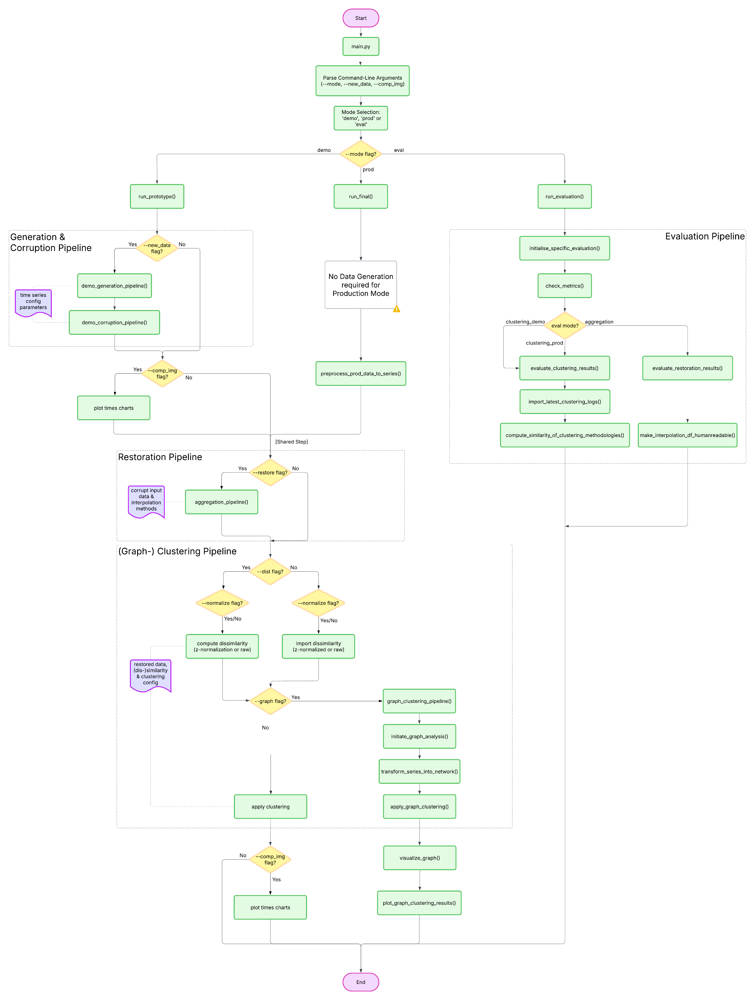

# Multi Scale Time Series Clustering

> Time-series data is a collection of data points recorded over time, each associated with a specific timestamp. This form of data is prevalent in various fields such as finance, economics, meteorology, healthcare, energy, telecommunications, and transportation. Current algorithms assume that we only have time-series data of the same scaling, but in real-world data time-series often consists of different scalings, e.g. hourly, daily, or weekly weather forecasts. This project will mainly focus on the development of a clustering algorithm that can handle time series with different scalings. 

## Table of Contents

- [Multi Scale Time Series Clustering](#multi-scale-time-series-clustering)
  - [Methodology](#methodology)
  - [Overview](#overview)
  - [Objectives](#objectives)
  - [Project Structure](#project-structure)
  - [Installation/Usage](#installationusage)
    - Clone the repository
    - Create and activate a virtual environment
    - Install dependencies
    - Run the project
    - Available Command-Line Flags
  - [Application Runtime Workflow](#application-runtime-workflow)
  - [Legacy](#legacy)
  - [License](#license)
  - [Contact & Acknowledgements](#contact--acknowledgements)


## Methodology

This project implements clustering of time-series data with varying temporal scales.
Initially, the system focused on segment-based clustering of a single time series (e.g., per-day analysis). 

As of **early April 2025**, the methodology has been extended to support clustering across **multiple full-length time series** (e.g., one per subject). This better reflects realistic energy datasets and supports broader comparison-based clustering.

The older version of the code is preserved at the commit tagged:

`feat(prototype): final version of segment-based clustering`

And the new implementation is tagged:

`prototype-v2: finalized multiseries clustering support`


## Overview

This repository contains code and documentation for my bachelor thesis on clustering time-series data with different scalings. The project focuses on developing clustering algorithms that are robust to the varying temporal resolutions found in real-world data (e.g., hourly, daily, weekly).

## Objectives

- **Develop clustering algorithms:** Create/apply methods that effectively cluster time-series data with different scalings.
- **Evaluate performance:** Test and validate the algorithms on various datasets.
- **Extension:** Completed graph representation of time series and graph-based clustering (Louvain, Modularity, Label Propagation). 
- **Evaluation (Work-in-Progress):** Add comprehensive evaluation pipeline to automatically analyze clustering and restoration accuracy across demo (synthetic) and production (real-world) datasets.


## Project Structure

```
.
├│ data/                  		# Sample datasets or links to data sources
│   ├── corrupted/  	        # Holds modified faulty series (prototype mode)
│      ├── ts_demo_data_<#>_corrupted
│      ├── ...
│   ├── generated/              # Multiple synthetically created demo series (prototype mode)
│      ├── ts_demo_data_<#>_clean
│      ├── ...
│   ├── legacy/  				# Holds deprecated prototype data
│   ├── restored/  				# Restored data by multiple means(e.g.: interpolation)
│      ├── <method>/            # Restored data through interpolation method
│            ├── ts_demo_data_<#>_<method> 
│            ├── ...
│      ├── ... 
├│ docs/                  		# Documentation and thesis drafts
├│ experiments/             	# Scripts and logs from experimental runs
│   ├── distance_matrices		# Exported dissimilarity/distance matrices used for clustering
│      ├── legacy/              # Deprecated distance matrices
│   ├── logs					# Log files from various experimental operations
│      ├── clustering
│            ├── default/              # Stores traditional time series clustering results
│            ├── graph/                # Stores graph-based clustering results on transformed data
│      ├── interpolations
│            ├── <method>/            # Stores interpolation accuracy of demo data
│            ├── legacy/              # Deprecated log files
│   ├── plots					# Plot diagrams from various experimental operations
│      ├── clustering/
│            ├── legacy/              # Deprecated plot diagrams
│            ├── ...
│      ├── comparisons/               # compare aggregated vs real demo data
│      ├── corrupted_data/            # Plots show faulty synthetic time series(demo)
│      ├── generated_data/            # Plots show generated synthetic time series(demo)
│      ├── graph_analysis/            # graph based analysis plots
│      ├── interpolations/
│            ├── <method>/
│            ├── legacy/              
|            ├── ...
│      ├── legacy/
├│ notebooks/					# Jupyter notebooks for exploratory analysis
├│ src/							# Source code (algorithms, utility functions)
│   ├── config.py  				# Stores essential parameters and constants
│   ├── data_corruption.py  	# Module for synthetic dataset corruption
│   ├── data_generation.py  	# Module for synthetic dataset generation
│   ├── data_restoration.py  	# Module for the restoration of data through various means
│   ├── main.py					# Main script with mode selection
│   ├── project_utilities.py	# helper utilities for the project
└│ CHANGELOG.md                	# Documents releases and changes 
└│ LICENSE                	  # Repo License
└│ README.md                	# Project overview and instructions
└│ requirements.txt               # Contain all external dependancies for the project
```


## Installation/Usage

1. **Clone the repository:**

    ```bash
	git clone https://github.com/QuirkyCroissant/Multi-Scale-Time-Series-Clustering
	```
	
	
2. **Create and activate a virtual environment:**

    ```bash
	python -m venv env
	source env/bin/activate   
	```
	
3. **Install dependencies:**

    ```bash
	pip install -r requirements.txt
	```

4. **Run the project:**

    You can now run the project in 3 main modes, specified by the following CLI arguments:
    
    ```bash
    # DEMO (Synthetic Pipeline)
    python src/main.py demo --new_data --restore --dist --comp_img

    # PRODUCTION (Real datasets - currently placeholder)
    python src/main.py prod

    # EVALUATION (Analyse restoration and clustering metrics)
    python src/main.py eval aggregation --metrics MSE MAPE
    python src/main.py eval clusteringDemo --metrics ARI RAND NMI
    python src/main.py eval clusteringProd --metrics Silhouette Modularity
    ```

    **Available Command-Line Flags:**
    - `--mode`: **Required** `demo` (synthetic pipeline), `prod` (real data pipeline), or `eval` (analyses previous results).

    - **DEMO Mode Options:**
      - `--new_data`: **Optional** Generates new synthetic data (clean and corrupted).
      - `--restore`: **Optional** Aggregates/interpolates/augments, and saves repaired faulty input data, that later will be used for clustering (saved in `data/restored`).
      - `--dist`: **Optional** Computes and saves the (dis-)/similarity measure (saved in `experiments/distance_matrices`).
      - `--normalized`: **Optional** Runs the application in (non-)normalized mode, depending on users cluster usecase(shape or scale based clustering).
      - `--comp_img`: **Optional** Saves comparison plots of the time series at various pipeline stages (e.g., clean vs. corrupted, and clean vs. interpolated).
    
    - **EVAL Mode Options (sub-modes):**
      - `aggregation`: Analyses restoration/interpolation/augmentation metrics
        - `MSE`, `MAPE`
      - `clustering_demo`: Analyses synthetic clustering quality metrics
        - `ARI`, `RAND`, `NMI`
      - `clustering_prod`: Analyses provided real-world clustering quality metrics
        - `Silhouette`, `Modularity`
      - `--metrics`: **Required** List of evaluation metrics to compute


## Application Runtime Workflow

The flowchart below summarizes the main pipelines of the project:


*Figure: Overall Projects Pipeline Flowchart*

## Legacy
Legacy prototypes are available under:
- [prototype-v3](https://github.com/QuirkyCroissant/Multi-Scale-Time-Series-Clustering/tree/prototype-v3) - graph transformation and graph-based clustering
- [prototype-v2](https://github.com/QuirkyCroissant/Multi-Scale-Time-Series-Clustering/tree/prototype-v2) - shift to multi-series time series support
- [prototype-v1](https://github.com/QuirkyCroissant/Multi-Scale-Time-Series-Clustering/tree/prototype-v1) - single time series segmentation clustering


## License

This project is licensed under the MIT License - see the [LICENSE](LICENSE) file for details.

## Contact & Acknowledgements

- **Supervisor:** [Ass.-Prof. Dott.ssa Dott.ssa.mag.Yllka Velaj, PhD](mailto:yllka.velaj@univie.ac.at)
- **Student:** Florian Hajek

Thank you to everyone who contributed to this project!